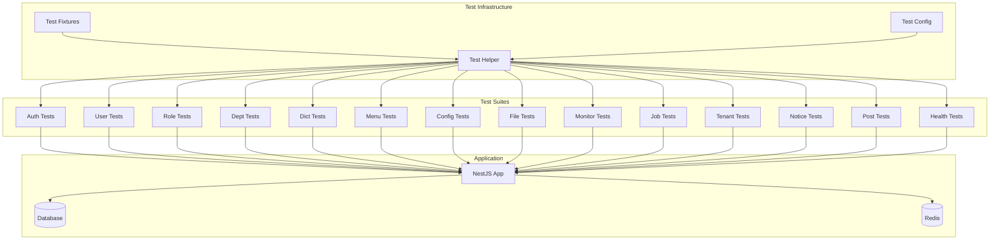

# Design Document: API Integration Testing

## Overview

本设计文档描述了对Nest-Admin-Soybean后台管理系统进行全面API集成测试的技术方案。测试将使用Jest + Supertest框架，采用模块化组织结构，覆盖系统的204个API端点。

## Architecture



## Components and Interfaces

### 1. Test Helper (TestHelper)

测试辅助类，提供通用的测试工具函数。

```typescript
interface TestHelper {
  // 初始化测试应用
  initApp(): Promise<INestApplication>;
  
  // 关闭测试应用
  closeApp(): Promise<void>;
  
  // 登录并获取Token
  login(username?: string, password?: string): Promise<string>;
  
  // 获取已认证的请求对象
  getAuthRequest(): request.SuperTest<request.Test>;
  
  // 获取未认证的请求对象
  getRequest(): request.SuperTest<request.Test>;
  
  // 清理测试数据
  cleanup(): Promise<void>;
}
```

### 2. Test Fixtures (TestFixtures)

测试数据工厂，提供测试数据的创建和管理。

```typescript
interface TestFixtures {
  // 用户相关
  createTestUser(data?: Partial<CreateUserDto>): Promise<User>;
  createTestRole(data?: Partial<CreateRoleDto>): Promise<Role>;
  createTestDept(data?: Partial<CreateDeptDto>): Promise<Dept>;
  
  // 字典相关
  createTestDictType(data?: Partial<CreateDictTypeDto>): Promise<DictType>;
  createTestDictData(data?: Partial<CreateDictDataDto>): Promise<DictData>;
  
  // 菜单相关
  createTestMenu(data?: Partial<CreateMenuDto>): Promise<Menu>;
  
  // 配置相关
  createTestConfig(data?: Partial<CreateConfigDto>): Promise<Config>;
  
  // 文件相关
  createTestFile(): Promise<{ buffer: Buffer; filename: string }>;
  
  // 清理所有测试数据
  cleanupAll(): Promise<void>;
}
```

### 3. API Response Types

```typescript
// 标准响应格式
interface ApiResponse<T = any> {
  code: number;
  msg: string;
  data: T;
}

// 分页响应格式
interface PaginatedResponse<T> {
  code: number;
  msg: string;
  data: {
    rows: T[];
    total: number;
    pageNum: number;
    pageSize: number;
  };
}

// 登录响应
interface LoginResponse {
  code: number;
  msg: string;
  data: {
    access_token: string;
  };
}

// 验证码响应
interface CaptchaResponse {
  code: number;
  msg: string;
  data: {
    uuid: string;
    img: string;
    captchaEnabled: boolean;
  };
}
```

## Data Models

### Test Configuration

```typescript
interface TestConfig {
  // 测试用户凭据
  adminUsername: string;
  adminPassword: string;
  
  // 测试租户
  tenantId: string;
  
  // API基础路径
  apiPrefix: string;
  
  // 超时设置
  timeout: number;
}
```

### Test Context

```typescript
interface TestContext {
  app: INestApplication;
  token: string;
  createdIds: {
    users: number[];
    roles: number[];
    depts: number[];
    dictTypes: number[];
    dictData: number[];
    menus: number[];
    configs: number[];
    notices: number[];
    posts: number[];
    jobs: number[];
    tenants: number[];
  };
}
```

## Correctness Properties

*A property is a characteristic or behavior that should hold true across all valid executions of a system-essentially, a formal statement about what the system should do. Properties serve as the bridge between human-readable specifications and machine-verifiable correctness guarantees.*

### Property 1: Response Format Consistency

*For any* API endpoint that returns a successful response, the response body SHALL contain a `code` field equal to 200 and a `data` field. *For any* API endpoint that returns a business error, the response body SHALL contain a non-200 `code` and a `msg` field describing the error.

**Validates: Requirements 16.1, 16.2**

### Property 2: Authentication Enforcement

*For any* protected API endpoint, when accessed without a valid authentication token, the response SHALL return HTTP status 401 with an appropriate error message.

**Validates: Requirements 16.3**

### Property 3: Authorization Enforcement

*For any* permission-protected API endpoint, when accessed by a user without the required permissions, the response SHALL return HTTP status 403 with an appropriate error message.

**Validates: Requirements 16.4**

### Property 4: Pagination Format Consistency

*For any* API endpoint that returns paginated data, the response SHALL contain `rows` (array), `total` (number), `pageNum` (number), and `pageSize` (number) fields in the data object.

**Validates: Requirements 16.5**

### Property 5: CRUD Idempotency for Read Operations

*For any* GET request to retrieve a resource by ID, calling the same endpoint multiple times with the same ID SHALL return identical results (assuming no intervening modifications).

**Validates: Requirements 3.3, 4.3, 5.3, 6.3, 7.3, 8.3**

### Property 6: Login Token Validity

*For any* valid login credentials, the returned token SHALL be usable for subsequent authenticated API calls until logout or expiration.

**Validates: Requirements 2.3, 2.5**

## Error Handling

### Error Categories

1. **Authentication Errors (401)**
   - Missing token
   - Invalid token
   - Expired token

2. **Authorization Errors (403)**
   - Insufficient permissions
   - Resource access denied

3. **Validation Errors (400)**
   - Invalid request body
   - Missing required fields
   - Invalid field values

4. **Not Found Errors (404)**
   - Resource not found
   - Invalid ID

5. **Business Logic Errors (500)**
   - Database errors
   - External service failures

### Error Response Format

```typescript
interface ErrorResponse {
  code: number;      // 业务错误码
  msg: string;       // 错误消息
  data: null;        // 错误时data为null
}
```

## Testing Strategy

### Coverage Target

**目标覆盖率：90%以上**

- 语句覆盖率 (Statements): ≥ 90%
- 分支覆盖率 (Branches): ≥ 90%
- 函数覆盖率 (Functions): ≥ 90%
- 行覆盖率 (Lines): ≥ 90%

### Test Framework

- **Jest**: 测试运行器和断言库
- **Supertest**: HTTP请求测试
- **fast-check**: 属性基测试库
- **@nestjs/testing**: NestJS测试工具

### Three-Layer Testing Strategy

#### 1. Unit Tests (单元测试)

单元测试针对独立的服务、工具函数和业务逻辑进行测试，使用Mock隔离外部依赖。

**测试范围：**
- Service层业务逻辑
- 工具函数和辅助方法
- DTO验证逻辑
- Guard和Interceptor
- 数据转换和格式化

**文件组织：**
```
server/src/
├── module/
│   ├── system/
│   │   ├── user/
│   │   │   ├── user.service.ts
│   │   │   └── user.service.spec.ts      # 单元测试
│   │   ├── role/
│   │   │   ├── role.service.ts
│   │   │   └── role.service.spec.ts
│   │   └── ...
│   └── ...
├── common/
│   ├── guards/
│   │   ├── jwt-auth.guard.ts
│   │   └── jwt-auth.guard.spec.ts
│   ├── interceptors/
│   │   └── *.spec.ts
│   └── utils/
│       └── *.spec.ts
```

**Mock策略：**
- PrismaService: 使用jest.mock模拟数据库操作
- RedisService: 使用jest.mock模拟缓存操作
- 外部服务: 使用jest.mock模拟HTTP调用

#### 2. Integration Tests (集成测试)

集成测试验证多个组件之间的协作，包括Controller-Service-Repository的完整调用链。

**测试范围：**
- Controller + Service集成
- Service + Repository集成
- 中间件和拦截器集成
- 缓存集成
- 数据库事务

**文件组织：**
```
server/test/
├── integration/
│   ├── auth/
│   │   ├── auth.integration.spec.ts
│   │   └── login-flow.integration.spec.ts
│   ├── user/
│   │   ├── user-crud.integration.spec.ts
│   │   └── user-role.integration.spec.ts
│   ├── role/
│   │   └── role-permission.integration.spec.ts
│   ├── dept/
│   │   └── dept-tree.integration.spec.ts
│   ├── dict/
│   │   └── dict-cache.integration.spec.ts
│   ├── menu/
│   │   └── menu-tree.integration.spec.ts
│   ├── config/
│   │   └── config-cache.integration.spec.ts
│   ├── file/
│   │   └── file-upload.integration.spec.ts
│   ├── monitor/
│   │   └── monitor-log.integration.spec.ts
│   ├── job/
│   │   └── job-schedule.integration.spec.ts
│   └── tenant/
│       └── tenant-isolation.integration.spec.ts
```

**测试数据库：**
- 使用测试专用数据库
- 每个测试套件前重置数据
- 使用事务回滚保证测试隔离

#### 3. E2E Tests (端到端测试)

E2E测试模拟真实的HTTP请求，验证完整的API行为。

**测试范围：**
- 完整的HTTP请求-响应流程
- 认证和授权流程
- 业务流程端到端验证
- API响应格式验证

**文件组织：**
```
server/test/
├── e2e/
│   ├── auth.e2e-spec.ts        # 认证模块测试
│   ├── user.e2e-spec.ts        # 用户管理测试
│   ├── role.e2e-spec.ts        # 角色管理测试
│   ├── dept.e2e-spec.ts        # 部门管理测试
│   ├── dict.e2e-spec.ts        # 字典管理测试
│   ├── menu.e2e-spec.ts        # 菜单管理测试
│   ├── config.e2e-spec.ts      # 参数配置测试
│   ├── file.e2e-spec.ts        # 文件管理测试
│   ├── monitor.e2e-spec.ts     # 监控模块测试
│   ├── job.e2e-spec.ts         # 定时任务测试
│   ├── tenant.e2e-spec.ts      # 租户管理测试
│   ├── notice.e2e-spec.ts      # 公告管理测试
│   ├── post.e2e-spec.ts        # 岗位管理测试
│   └── health.e2e-spec.ts      # 健康检查测试
├── helpers/
│   ├── test-helper.ts          # 测试辅助类
│   └── test-fixtures.ts        # 测试数据工厂
├── properties/
│   └── api-response.pbt.spec.ts # 属性基测试
├── fixtures/
│   └── index.ts                # 测试数据定义
└── setup.ts                    # 测试设置
```

### Property-Based Tests (属性基测试)

属性基测试验证系统的通用属性，使用随机生成的输入进行大量测试。

**测试范围：**
- 响应格式一致性
- 认证/授权行为
- 分页格式
- 数据验证规则

**配置：**
- 使用 `fast-check` 库
- 每个属性测试最少100次迭代
- 测试标签格式: `**Feature: api-integration-testing, Property {number}: {property_text}**`

### Test Execution Commands

```bash
# 运行所有单元测试
npm run test

# 运行单元测试并生成覆盖率报告
npm run test:cov

# 运行集成测试
npm run test:integration

# 运行所有E2E测试
npm run test:e2e

# 运行特定模块E2E测试
npm run test:e2e -- --testPathPattern=auth

# 运行属性基测试
npm run test:e2e -- --testPathPattern=pbt

# 运行所有测试并生成完整覆盖率报告
npm run test:all
```

### Jest Configuration Updates

```javascript
// jest.config.js 更新
module.exports = {
  // ... existing config
  coverageThreshold: {
    global: {
      branches: 90,
      functions: 90,
      lines: 90,
      statements: 90,
    },
  },
  collectCoverageFrom: [
    'src/**/*.ts',
    '!src/**/*.spec.ts',
    '!src/**/*.d.ts',
    '!src/main.ts',
  ],
};
```

### Coverage Report

测试完成后生成的覆盖率报告位于 `server/coverage/` 目录：
- `coverage/lcov-report/index.html` - HTML格式报告
- `coverage/coverage-final.json` - JSON格式报告
- `coverage/lcov.info` - LCOV格式报告
