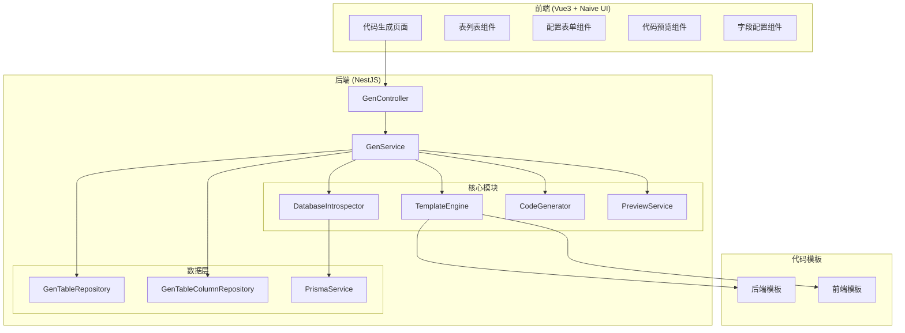

# Design Document: Code Generator

## Overview

本设计文档描述了 Nest-Admin-Soybean 系统的前后端代码生成功能的技术实现方案。该功能参考 RuoYi 代码生成器设计，基于数据库表结构，通过模板引擎自动生成符合项目规范的 NestJS 后端代码和 Vue3 + Naive UI 前端代码。

### RuoYi 代码生成器核心功能

参考 RuoYi 实现以下核心功能：

1. **数据库表管理**
   - 查询数据库表列表（排除已导入的表）
   - 导入选中的表到代码生成配置
   - 支持批量导入多张表

2. **代码生成配置**
   - 基本信息配置：表名、表描述、实体类名、作者、备注
   - 生成信息配置：生成模板（单表/树表/主子表）、生成包路径、生成模块名、生成业务名、生成功能名、上级菜单
   - 字段信息配置：字段描述、物理类型、TS类型、TS属性、插入、编辑、列表、查询、查询方式、必填、显示类型、字典类型
   - **主子表配置**：关联子表、子表外键

3. **代码预览**
   - 预览生成的所有代码文件
   - 支持语法高亮显示
   - 按文件类型分组展示

4. **代码生成**
   - 生成代码并下载 ZIP 压缩包
   - 支持批量生成多张表的代码
   - 支持自定义生成路径

5. **同步表结构**
   - 检测数据库表结构变化
   - 自动添加新字段、标记删除字段
   - 保留已有的自定义配置

### 企业级增强功能

为满足企业级开发需求，本代码生成器在 RuoYi 基础上增加以下高级功能：

#### 6. **数据权限支持**
   - 生成的代码自动集成数据权限注解
   - 支持按部门、按用户、按角色的数据过滤
   - 可配置数据权限范围（全部数据/本部门数据/本部门及以下/仅本人数据/自定义）
   - 生成 DataScope 装饰器和相关查询逻辑

#### 7. **Excel 导入导出**
   - 自动生成 Excel 导出功能（支持自定义导出字段）
   - 自动生成 Excel 导入功能（支持模板下载）
   - 支持导入数据校验和错误提示
   - 支持大数据量分批导出
   - 支持导出字段格式化（日期、字典、数值）
   - 支持合并单元格导出（主子表场景）

#### 8. **多租户支持**
   - 生成的代码自动集成租户隔离
   - 支持租户字段自动注入
   - 支持跨租户数据查询（管理员场景）
   - 租户相关字段自动过滤

#### 9. **审计日志**
   - 自动生成操作日志记录代码
   - 支持记录新增、修改、删除、导出等操作
   - 支持记录操作前后数据对比
   - 集成 @Operlog 装饰器

#### 10. **高级查询功能**
   - 支持多字段组合查询
   - 支持日期范围查询
   - 支持模糊查询、精确查询、范围查询
   - 支持排序字段配置
   - 支持高级搜索面板（可展开/收起）

#### 11. **前端增强功能**
   - 表格列宽可拖拽调整
   - 表格列显示/隐藏配置
   - 表格数据本地缓存
   - 表单字段联动配置
   - 支持行内编辑模式
   - 支持批量编辑功能
   - 支持数据导入预览

#### 12. **API 文档生成**
   - 自动生成 Swagger/OpenAPI 文档注解
   - 支持接口分组和标签
   - 支持请求/响应示例
   - 支持接口权限说明

#### 13. **代码质量保障**
   - 生成的代码包含完整的 TypeScript 类型定义
   - 生成的代码包含 ESLint 规范注释
   - 生成的 DTO 包含完整的 class-validator 校验
   - 生成的代码包含单元测试模板

#### 14. **自定义模板管理**
   - 支持在线编辑代码模板
   - 支持模板版本管理
   - 支持模板导入导出
   - 支持模板变量预览
   - 支持创建自定义模板分组

### 支持的模板类型

| 模板类型 | 说明 | 适用场景 |
|---------|------|---------|
| **crud** | 单表操作 | 简单的增删改查，如：岗位管理、通知公告 |
| **tree** | 树表操作 | 具有层级关系的数据，如：部门管理、菜单管理 |
| **sub** | 主子表操作 | 一对多关联关系，如：订单-订单明细、合同-合同条款 |

### 主子表（关联表）功能说明

主子表模式用于处理一对多的关联关系，例如：
- 订单表（主表）与订单明细表（子表）
- 合同表（主表）与合同条款表（子表）
- 商品表（主表）与商品规格表（子表）

**配置项：**
- `subTableName`: 关联子表的表名
- `subTableFkName`: 子表关联的外键名（指向主表主键）

**生成的代码特点：**
- 主表 Controller 包含子表的 CRUD 操作
- 主表 Service 包含级联操作（新增/修改时同步处理子表数据）
- 前端页面包含子表的嵌套表格或 Tab 展示
- DTO 包含子表数据的嵌套结构

系统采用模块化设计，包含数据库内省、配置管理、模板渲染、代码预览和代码输出五个核心模块。使用 EJS 作为模板引擎，支持 ZIP 下载和直接写入项目目录两种输出方式。

## Architecture



## Components and Interfaces

### 1. Database Introspector (数据库内省器)

负责从 PostgreSQL 数据库读取表结构元数据。

```typescript
// server/src/module/system/tool/gen/services/database-introspector.service.ts

interface TableMetadata {
  tableName: string;
  tableComment: string;
  columns: ColumnMetadata[];
}

interface ColumnMetadata {
  columnName: string;
  columnComment: string;
  columnType: string;      // PostgreSQL 类型
  isNullable: boolean;
  isPrimaryKey: boolean;
  isAutoIncrement: boolean;
  defaultValue: string | null;
  maxLength: number | null;
}

interface IDatabaseIntrospector {
  // 获取所有业务表（排除系统表）
  listTables(): Promise<TableMetadata[]>;
  
  // 获取指定表的详细信息
  getTableInfo(tableName: string): Promise<TableMetadata>;
  
  // 检查表是否存在
  tableExists(tableName: string): Promise<boolean>;
}
```

### 2. Template Engine (模板引擎)

基于 EJS 的模板渲染引擎，负责将配置数据渲染为代码文件。

```typescript
// server/src/module/system/tool/gen/services/template-engine.service.ts

interface TemplateContext {
  table: GenTableConfig;
  columns: GenColumnConfig[];
  pkColumn: GenColumnConfig;
  author: string;
  datetime: string;
  moduleName: string;
  businessName: string;
  className: string;
  classNameLower: string;
}

interface GeneratedFile {
  fileName: string;
  filePath: string;
  content: string;
  fileType: 'backend' | 'frontend';
}

interface ITemplateEngine {
  // 渲染单个模板
  render(templateName: string, context: TemplateContext): Promise<string>;
  
  // 批量渲染所有模板
  renderAll(context: TemplateContext): Promise<GeneratedFile[]>;
  
  // 获取可用模板列表
  listTemplates(): string[];
}
```

### 3. Code Generator (代码生成器)

核心生成逻辑，协调各模块完成代码生成。

```typescript
// server/src/module/system/tool/gen/services/code-generator.service.ts

interface GenerateOptions {
  tableIds: number[];
  genType: 'ZIP' | 'PATH';
  genPath?: string;
}

interface GenerateResult {
  success: boolean;
  files: GeneratedFile[];
  zipBuffer?: Buffer;
  errors?: string[];
}

interface ICodeGenerator {
  // 生成代码
  generate(options: GenerateOptions): Promise<GenerateResult>;
  
  // 预览代码（不写入文件）
  preview(tableId: number): Promise<GeneratedFile[]>;
  
  // 批量生成并打包
  batchGenerate(tableIds: number[]): Promise<Buffer>;
}
```

### 4. GenTable Controller

RESTful API 控制器，参考 RuoYi 的 API 设计。

```typescript
// server/src/module/system/tool/gen/gen.controller.ts

@Controller('tool/gen')
export class GenController {
  // ========== 数据库表管理 ==========
  
  // 查询数据库表列表（排除已导入的表）
  @Get('/db/list')
  listDbTables(query: ListDbTableDto): Promise<Result>;
  
  // 导入表结构
  @Post('/importTable')
  importTable(@Query('tables') tables: string): Promise<Result>;
  
  // ========== 代码生成配置管理 ==========
  
  // 查询已导入的表列表
  @Get('/list')
  listGenTables(query: ListGenTableDto): Promise<Result>;
  
  // 获取表详情（包含字段信息）
  @Get('/:tableId')
  getTableInfo(@Param('tableId') tableId: number): Promise<Result>;
  
  // 修改代码生成配置
  @Put('/')
  updateGenTable(@Body() dto: UpdateGenTableDto): Promise<Result>;
  
  // 删除代码生成配置
  @Delete('/:tableIds')
  deleteGenTable(@Param('tableIds') tableIds: string): Promise<Result>;
  
  // ========== 代码生成 ==========
  
  // 预览代码
  @Get('/preview/:tableId')
  previewCode(@Param('tableId') tableId: number): Promise<Result>;
  
  // 生成代码（下载ZIP）
  @Get('/download/:tableName')
  downloadCode(@Param('tableName') tableName: string, @Res() res: Response): Promise<void>;
  
  // 批量生成代码（下载ZIP）
  @Get('/batchGenCode')
  batchGenCode(@Query('tables') tables: string, @Res() res: Response): Promise<void>;
  
  // 生成代码（自定义路径）
  @Get('/genCode/:tableName')
  genCode(@Param('tableName') tableName: string): Promise<Result>;
  
  // ========== 同步功能 ==========
  
  // 同步数据库表结构
  @Get('/synchDb/:tableId')
  syncDatabase(@Param('tableId') tableId: number): Promise<Result>;
}
```

### 5. Frontend Components (参考 RuoYi 前端设计)

```
admin-naive-ui/src/views/tool/gen/
├── index.vue                    # 代码生成主页面（表列表）
└── modules/
    ├── gen-import-modal.vue     # 导入表弹窗
    ├── gen-edit-drawer.vue      # 编辑配置抽屉
    │   ├── basic-info.vue       # 基本信息配置
    │   ├── gen-info.vue         # 生成信息配置
    │   ├── column-info.vue      # 字段信息配置
    │   └── enterprise-info.vue  # 企业级功能配置（新增）
    ├── gen-preview-modal.vue    # 代码预览弹窗
    ├── gen-template-modal.vue   # 模板管理弹窗（新增）
    └── gen-search.vue           # 搜索组件

admin-naive-ui/src/service/api/tool/
└── gen.ts                       # 代码生成 API 服务

admin-naive-ui/src/typings/api/
└── tool.api.d.ts               # 类型定义（追加 Gen 相关类型）
```

### 前端页面功能说明

**主页面 (index.vue)**
- 表格展示已导入的表列表
- 支持搜索：表名称、表描述
- 操作按钮：导入、预览、编辑、删除、同步、生成代码
- 批量操作：批量删除、批量生成

**导入表弹窗 (gen-import-modal.vue)**
- 展示数据库中未导入的表列表
- 支持搜索过滤
- 多选导入

**编辑配置抽屉 (gen-edit-drawer.vue)**
- Tab 1 - 基本信息：表名称、表描述、实体类名称、作者、备注
- Tab 2 - 生成信息：生成模板、生成包路径、生成模块名、生成业务名、生成功能名、上级菜单
- Tab 3 - 字段信息：可编辑表格，配置每个字段的属性
- Tab 4 - 企业级功能：数据权限、导入导出、多租户、审计日志等配置（新增）

**代码预览弹窗 (gen-preview-modal.vue)**
- Tab 分组展示生成的代码文件
- 代码高亮显示
- 支持复制代码

**模板管理弹窗 (gen-template-modal.vue)** （新增）
- 查看和编辑代码模板
- 模板变量说明
- 模板预览

## Data Models

### GenTable 配置模型 (参考 RuoYi gen_table + 企业级扩展)

```typescript
interface GenTableConfig {
  tableId: number;              // 编号
  tableName: string;            // 表名称
  tableComment: string;         // 表描述
  subTableName?: string;        // 关联子表的表名
  subTableFkName?: string;      // 子表关联的外键名
  className: string;            // 实体类名称 (PascalCase)
  tplCategory: TplCategory;     // 使用的模板（crud单表操作 tree树表操作 sub主子表操作）
  tplWebType: TplWebType;       // 前端模板类型
  packageName: string;          // 生成包路径
  moduleName: string;           // 生成模块名
  businessName: string;         // 生成业务名
  functionName: string;         // 生成功能名
  functionAuthor: string;       // 生成功能作者
  genType: GenType;             // 生成代码方式（0zip压缩包 1自定义路径）
  genPath: string;              // 生成路径（不填默认项目路径）
  options: GenOptions;          // 其它生成选项（JSON格式）
  status: Status;               // 状态
  delFlag: DelFlag;             // 删除标志
  createBy: string;             // 创建者
  createTime: Date;             // 创建时间
  updateBy: string;             // 更新者
  updateTime: Date;             // 更新时间
  remark?: string;              // 备注
}

type TplCategory = 'crud' | 'tree' | 'sub';
type TplWebType = 'naive-ui';
type GenType = 'ZIP' | 'PATH';

interface GenOptions {
  // 树表配置
  treeCode?: string;            // 树编码字段
  treeParentCode?: string;      // 树父编码字段
  treeName?: string;            // 树名称字段
  parentMenuId?: number;        // 上级菜单ID
  parentMenuName?: string;      // 上级菜单名称
  
  // ========== 企业级功能配置 ==========
  
  // 数据权限配置
  enableDataScope?: boolean;    // 是否启用数据权限
  dataScopeColumn?: string;     // 数据权限关联字段（通常是 deptId 或 createBy）
  dataScopeType?: DataScopeType; // 数据权限类型
  
  // 导入导出配置
  enableExport?: boolean;       // 是否启用导出功能
  enableImport?: boolean;       // 是否启用导入功能
  exportFields?: string[];      // 导出字段列表（为空则导出所有列表字段）
  importFields?: string[];      // 导入字段列表
  exportFileName?: string;      // 导出文件名模板
  
  // 多租户配置
  enableTenant?: boolean;       // 是否启用多租户
  tenantColumn?: string;        // 租户字段名（默认 tenantId）
  
  // 审计日志配置
  enableOperlog?: boolean;      // 是否启用操作日志
  operlogTitle?: string;        // 操作日志标题
  
  // 高级查询配置
  enableAdvancedSearch?: boolean; // 是否启用高级搜索
  defaultSortField?: string;    // 默认排序字段
  defaultSortOrder?: 'asc' | 'desc'; // 默认排序方向
  
  // 前端增强配置
  enableColumnResize?: boolean; // 是否启用列宽调整
  enableColumnToggle?: boolean; // 是否启用列显示切换
  enableInlineEdit?: boolean;   // 是否启用行内编辑
  enableBatchEdit?: boolean;    // 是否启用批量编辑
  tableHeight?: number;         // 表格固定高度
  
  // API 文档配置
  apiGroup?: string;            // API 分组名称
  apiDescription?: string;      // API 描述
  
  // 代码质量配置
  enableUnitTest?: boolean;     // 是否生成单元测试
  enableE2ETest?: boolean;      // 是否生成 E2E 测试
}

// 数据权限类型
type DataScopeType = 
  | 'ALL'           // 全部数据权限
  | 'CUSTOM'        // 自定义数据权限
  | 'DEPT'          // 本部门数据权限
  | 'DEPT_AND_CHILD'// 本部门及以下数据权限
  | 'SELF';         // 仅本人数据权限
```

### 主子表关联配置

当 `tplCategory` 为 `sub` 时，需要配置以下关联信息：

```typescript
interface SubTableConfig {
  // 主表配置
  mainTable: {
    tableId: number;
    tableName: string;
    className: string;
    pkColumn: GenColumnConfig;  // 主键字段
  };
  
  // 子表配置
  subTable: {
    tableId: number;
    tableName: string;           // 子表名称（subTableName）
    className: string;
    fkColumn: GenColumnConfig;   // 外键字段（subTableFkName 对应的字段）
  };
}
```

**主子表生成的代码结构：**

```
// 后端代码
server/src/module/{moduleName}/{businessName}/
├── {businessName}.module.ts
├── {businessName}.controller.ts      # 包含主表和子表的 CRUD
├── {businessName}.service.ts         # 包含级联操作
├── {businessName}.repository.ts
├── dto/
│   ├── create-{businessName}.dto.ts  # 包含子表数据数组
│   ├── update-{businessName}.dto.ts
│   ├── list-{businessName}.dto.ts
│   └── index.ts
└── vo/
    └── {businessName}.vo.ts          # 包含子表数据

// 前端代码
admin-naive-ui/src/views/{moduleName}/{businessName}/
├── index.vue                          # 主表列表
└── modules/
    ├── {businessName}-search.vue
    ├── {businessName}-operate-drawer.vue  # 包含子表编辑
    └── sub-table.vue                  # 子表组件
```
```

### GenTableColumn 字段配置模型 (参考 RuoYi gen_table_column + 企业级扩展)

```typescript
interface GenColumnConfig {
  columnId: number;             // 编号
  tableId: number;              // 归属表编号
  columnName: string;           // 列名称
  columnComment: string;        // 列描述
  columnType: string;           // 列类型
  tsType: string;               // TypeScript 类型
  tsField: string;              // TypeScript 属性名 (camelCase)
  isPk: YesNo;                  // 是否主键（1是）
  isIncrement: YesNo;           // 是否自增（1是）
  isRequired: YesNo;            // 是否必填（1是）
  isInsert: YesNo;              // 是否为插入字段（1是）
  isEdit: YesNo;                // 是否编辑字段（1是）
  isList: YesNo;                // 是否列表字段（1是）
  isQuery: YesNo;               // 是否查询字段（1是）
  queryType: QueryType;         // 查询方式（等于、不等于、大于、小于、范围）
  htmlType: HtmlType;           // 显示类型（文本框、文本域、下拉框、复选框、单选框、日期控件）
  dictType: string;             // 字典类型
  columnDefault?: string;       // 默认值
  sort: number;                 // 排序
  status: Status;               // 状态
  delFlag: DelFlag;             // 删除标志
  createBy: string;             // 创建者
  createTime: Date;             // 创建时间
  updateBy: string;             // 更新者
  updateTime: Date;             // 更新时间
  remark?: string;              // 备注
  
  // ========== 企业级功能扩展字段 ==========
  
  // 导入导出配置
  isExport: YesNo;              // 是否导出字段
  isImport: YesNo;              // 是否导入字段
  exportFormat?: string;        // 导出格式化（日期格式、数值格式等）
  importValidation?: string;    // 导入校验规则（正则表达式）
  
  // 表格显示配置
  columnWidth?: number;         // 列宽度
  columnAlign?: 'left' | 'center' | 'right'; // 列对齐方式
  columnFixed?: 'left' | 'right'; // 列固定位置
  columnSortable?: YesNo;       // 是否可排序
  columnEllipsis?: YesNo;       // 是否显示省略号
  
  // 表单配置
  formColSpan?: number;         // 表单列占比（1-24）
  formPlaceholder?: string;     // 表单占位符
  formDefaultValue?: string;    // 表单默认值
  formDisabled?: YesNo;         // 是否禁用
  formReadonly?: YesNo;         // 是否只读
  
  // 字段联动配置
  linkageField?: string;        // 联动字段名
  linkageType?: 'show' | 'hide' | 'enable' | 'disable'; // 联动类型
  linkageValue?: string;        // 联动触发值
  
  // 数据校验配置
  validationMin?: number;       // 最小值/最小长度
  validationMax?: number;       // 最大值/最大长度
  validationPattern?: string;   // 正则校验
  validationMessage?: string;   // 校验失败提示
}

type YesNo = 'Y' | 'N';
type QueryType = 'EQ' | 'NE' | 'GT' | 'GE' | 'LT' | 'LE' | 'LIKE' | 'BETWEEN' | 'IN' | 'NOT_IN';
type HtmlType = 'input' | 'textarea' | 'select' | 'radio' | 'checkbox' | 
                'datetime' | 'date' | 'time' | 'upload' | 'editor' | 'number' | 
                'imageUpload' | 'fileUpload' | 'switch' | 'slider' | 'rate' |
                'colorPicker' | 'treeSelect' | 'cascader' | 'transfer';
```

### 类型映射表

```typescript
// PostgreSQL 类型到 TypeScript 类型的映射
const TYPE_MAPPING: Record<string, string> = {
  // 数值类型
  'int2': 'number',
  'int4': 'number',
  'int8': 'number',
  'integer': 'number',
  'bigint': 'number',
  'smallint': 'number',
  'decimal': 'number',
  'numeric': 'number',
  'real': 'number',
  'float4': 'number',
  'float8': 'number',
  'double precision': 'number',
  
  // 字符串类型
  'varchar': 'string',
  'char': 'string',
  'text': 'string',
  'uuid': 'string',
  
  // 布尔类型
  'bool': 'boolean',
  'boolean': 'boolean',
  
  // 日期时间类型
  'timestamp': 'Date',
  'timestamptz': 'Date',
  'date': 'Date',
  'time': 'string',
  'timetz': 'string',
  
  // JSON 类型
  'json': 'object',
  'jsonb': 'object',
};

// 数据库类型到表单控件的映射
const HTML_TYPE_MAPPING: Record<string, HtmlType> = {
  'varchar': 'input',
  'char': 'input',
  'text': 'textarea',
  'int2': 'number',
  'int4': 'number',
  'int8': 'number',
  'integer': 'number',
  'bigint': 'number',
  'decimal': 'number',
  'numeric': 'number',
  'bool': 'radio',
  'boolean': 'radio',
  'timestamp': 'datetime',
  'timestamptz': 'datetime',
  'date': 'date',
};
```


## Template Structure

### 后端模板文件结构

```
server/src/module/system/tool/gen/templates/
├── backend/
│   ├── module.ejs           # NestJS Module
│   ├── controller.ejs       # Controller
│   ├── service.ejs          # Service
│   ├── repository.ejs       # Repository
│   ├── dto/
│   │   ├── create.ejs       # CreateDto
│   │   ├── update.ejs       # UpdateDto
│   │   ├── list.ejs         # ListDto (查询)
│   │   └── index.ejs        # DTO 导出
│   └── vo/
│       └── vo.ejs           # VO 响应类
├── frontend/
│   ├── api.ejs              # API 服务
│   ├── types.ejs            # TypeScript 类型
│   ├── index.vue.ejs        # 主页面
│   └── modules/
│       ├── search.vue.ejs   # 搜索组件
│       └── drawer.vue.ejs   # 编辑抽屉
└── sql/
    └── menu.sql.ejs         # 菜单 SQL
```

### 前端 API 类型定义

```typescript
// admin-naive-ui/src/typings/api/tool.api.d.ts

declare namespace Api {
  namespace Tool {
    /** 代码生成表 */
    type GenTable = Common.CommonRecord<{
      tableId: CommonType.IdType;
      tableName: string;
      tableComment: string;
      subTableName?: string;
      subTableFkName?: string;
      className: string;
      tplCategory: 'crud' | 'tree' | 'sub';
      tplWebType: string;
      packageName: string;
      moduleName: string;
      businessName: string;
      functionName: string;
      functionAuthor: string;
      genType: '0' | '1';
      genPath: string;
      options: string;
      remark?: string;
    }>;

    /** 代码生成字段 */
    type GenTableColumn = Common.CommonRecord<{
      columnId: CommonType.IdType;
      tableId: CommonType.IdType;
      columnName: string;
      columnComment: string;
      columnType: string;
      tsType: string;
      tsField: string;
      isPk: Common.YesOrNoStatus;
      isIncrement: Common.YesOrNoStatus;
      isRequired: Common.YesOrNoStatus;
      isInsert: Common.YesOrNoStatus;
      isEdit: Common.YesOrNoStatus;
      isList: Common.YesOrNoStatus;
      isQuery: Common.YesOrNoStatus;
      queryType: string;
      htmlType: string;
      dictType: string;
      sort: number;
    }>;

    /** 表详情（包含字段） */
    type GenTableInfo = GenTable & {
      columns: GenTableColumn[];
      info: GenTable;
      rows: GenTableColumn[];
    };

    /** 数据库表信息 */
    type DbTable = {
      tableName: string;
      tableComment: string;
      createTime: string;
      updateTime: string;
    };

    /** 代码预览结果 */
    type PreviewCode = Record<string, string>;

    /** 表搜索参数 */
    type GenTableSearchParams = CommonType.RecordNullable<
      Pick<GenTable, 'tableName' | 'tableComment'> & Api.Common.CommonSearchParams
    >;

    /** 数据库表搜索参数 */
    type DbTableSearchParams = CommonType.RecordNullable<{
      tableName?: string;
      tableComment?: string;
    }> & Api.Common.CommonSearchParams;

    /** 表操作参数 */
    type GenTableOperateParams = CommonType.RecordNullable<
      GenTable & { columns: GenTableColumn[] }
    >;

    /** 表列表 */
    type GenTableList = Common.PaginatingQueryRecord<GenTable>;

    /** 数据库表列表 */
    type DbTableList = Common.PaginatingQueryRecord<DbTable>;
  }
}
```

### 前端 API 服务

```typescript
// admin-naive-ui/src/service/api/tool/gen.ts

import { request } from '@/service/request';

/** 查询代码生成列表 */
export function fetchGetGenTableList(params?: Api.Tool.GenTableSearchParams) {
  return request<Api.Tool.GenTableList>({
    url: '/tool/gen/list',
    method: 'get',
    params,
  });
}

/** 查询数据库表列表 */
export function fetchGetDbTableList(params?: Api.Tool.DbTableSearchParams) {
  return request<Api.Tool.DbTableList>({
    url: '/tool/gen/db/list',
    method: 'get',
    params,
  });
}

/** 导入表 */
export function fetchImportTable(tables: string) {
  return request<boolean>({
    url: '/tool/gen/importTable',
    method: 'post',
    params: { tables },
  });
}

/** 获取表详情 */
export function fetchGetGenTableInfo(tableId: CommonType.IdType) {
  return request<Api.Tool.GenTableInfo>({
    url: `/tool/gen/${tableId}`,
    method: 'get',
  });
}

/** 修改代码生成配置 */
export function fetchUpdateGenTable(data: Api.Tool.GenTableOperateParams) {
  return request<boolean>({
    url: '/tool/gen',
    method: 'put',
    data,
  });
}

/** 删除代码生成配置 */
export function fetchDeleteGenTable(tableIds: CommonType.IdType[]) {
  return request<boolean>({
    url: `/tool/gen/${tableIds.join(',')}`,
    method: 'delete',
  });
}

/** 预览代码 */
export function fetchPreviewCode(tableId: CommonType.IdType) {
  return request<Api.Tool.PreviewCode>({
    url: `/tool/gen/preview/${tableId}`,
    method: 'get',
  });
}

/** 同步数据库 */
export function fetchSyncDb(tableId: CommonType.IdType) {
  return request<boolean>({
    url: `/tool/gen/synchDb/${tableId}`,
    method: 'get',
  });
}

/** 生成代码（自定义路径） */
export function fetchGenCode(tableName: string) {
  return request<boolean>({
    url: `/tool/gen/genCode/${tableName}`,
    method: 'get',
  });
}
```

### 模板变量说明

```typescript
interface TemplateVariables {
  // 表信息
  tableName: string;           // sys_example
  tableComment: string;        // 示例表
  className: string;           // Example (PascalCase)
  classNameLower: string;      // example (camelCase)
  
  // 模块信息
  moduleName: string;          // system
  businessName: string;        // example
  functionName: string;        // 示例管理
  functionAuthor: string;      // admin
  
  // 路径信息
  packageName: string;         // src/module/system
  apiPath: string;             // /system/example
  
  // 字段信息
  columns: GenColumnConfig[];  // 所有字段
  pkColumn: GenColumnConfig;   // 主键字段
  listColumns: GenColumnConfig[];    // 列表显示字段
  formColumns: GenColumnConfig[];    // 表单字段
  queryColumns: GenColumnConfig[];   // 查询字段
  
  // 辅助信息
  datetime: string;            // 生成时间
  hasDict: boolean;            // 是否有字典字段
  dictTypes: string[];         // 使用的字典类型
}
```

## Generated Code Examples

### 后端 Controller 示例（单表 CRUD）

```typescript
// 生成的 example.controller.ts
import { Controller, Get, Post, Body, Put, Param, Delete, Query } from '@nestjs/common';
import { ApiTags, ApiBearerAuth } from '@nestjs/swagger';
import { ExampleService } from './example.service';
import { CreateExampleDto, UpdateExampleDto, ListExampleDto } from './dto/index';
import { RequirePermission } from 'src/common/decorators/require-permission.decorator';
import { Api } from 'src/common/decorators/api.decorator';
import { ExampleVo, ExampleListVo } from './vo/example.vo';
import { Operlog } from 'src/common/decorators/operlog.decorator';
import { BusinessType } from 'src/common/constant/business.constant';
import { UserTool, UserToolType } from '../user/user.decorator';

@ApiTags('示例管理')
@Controller('system/example')
@ApiBearerAuth('Authorization')
export class ExampleController {
  constructor(private readonly exampleService: ExampleService) {}

  @Api({ summary: '示例管理-创建', body: CreateExampleDto })
  @RequirePermission('system:example:add')
  @Operlog({ businessType: BusinessType.INSERT })
  @Post('/')
  create(@Body() createDto: CreateExampleDto, @UserTool() { injectCreate }: UserToolType) {
    return this.exampleService.create(injectCreate(createDto));
  }

  @Api({ summary: '示例管理-列表', type: ExampleListVo })
  @RequirePermission('system:example:list')
  @Get('/list')
  findAll(@Query() query: ListExampleDto) {
    return this.exampleService.findAll(query);
  }

  @Api({ summary: '示例管理-详情', type: ExampleVo })
  @RequirePermission('system:example:query')
  @Get('/:id')
  findOne(@Param('id') id: string) {
    return this.exampleService.findOne(+id);
  }

  @Api({ summary: '示例管理-更新', body: UpdateExampleDto })
  @RequirePermission('system:example:edit')
  @Operlog({ businessType: BusinessType.UPDATE })
  @Put('/')
  update(@Body() updateDto: UpdateExampleDto) {
    return this.exampleService.update(updateDto);
  }

  @Api({ summary: '示例管理-删除' })
  @RequirePermission('system:example:remove')
  @Operlog({ businessType: BusinessType.DELETE })
  @Delete('/:ids')
  remove(@Param('ids') ids: string) {
    return this.exampleService.remove(ids.split(','));
  }
}
```

### 主子表 Service 示例

```typescript
// 生成的 order.service.ts（主子表模式）
import { Injectable } from '@nestjs/common';
import { Prisma } from '@prisma/client';
import { Result } from 'src/common/response';
import { DelFlagEnum } from 'src/common/enum/index';
import { CreateOrderDto, UpdateOrderDto, ListOrderDto } from './dto/index';
import { PrismaService } from 'src/prisma/prisma.service';
import { OrderRepository } from './order.repository';
import { Transactional } from 'src/common/decorators/transactional.decorator';

@Injectable()
export class OrderService {
  constructor(
    private readonly prisma: PrismaService,
    private readonly orderRepo: OrderRepository,
  ) {}

  /**
   * 新增订单（包含订单明细）
   */
  @Transactional()
  async create(createOrderDto: CreateOrderDto) {
    const { orderItems, ...orderData } = createOrderDto;
    
    // 创建主表数据
    const order = await this.orderRepo.create({
      ...orderData,
      delFlag: DelFlagEnum.NORMAL,
    });
    
    // 创建子表数据
    if (orderItems && orderItems.length > 0) {
      await this.prisma.orderItem.createMany({
        data: orderItems.map(item => ({
          ...item,
          orderId: order.orderId,
          delFlag: DelFlagEnum.NORMAL,
        })),
      });
    }
    
    return Result.ok();
  }

  /**
   * 查询订单详情（包含订单明细）
   */
  async findOne(orderId: number) {
    const order = await this.orderRepo.findById(orderId);
    
    // 查询子表数据
    const orderItems = await this.prisma.orderItem.findMany({
      where: { orderId, delFlag: DelFlagEnum.NORMAL },
      orderBy: { sort: 'asc' },
    });
    
    return Result.ok({ ...order, orderItems });
  }

  /**
   * 修改订单（包含订单明细）
   */
  @Transactional()
  async update(updateOrderDto: UpdateOrderDto) {
    const { orderId, orderItems, ...orderData } = updateOrderDto;
    
    // 更新主表数据
    await this.orderRepo.update(orderId, orderData);
    
    // 删除原有子表数据
    await this.prisma.orderItem.updateMany({
      where: { orderId },
      data: { delFlag: DelFlagEnum.DELETED },
    });
    
    // 重新创建子表数据
    if (orderItems && orderItems.length > 0) {
      await this.prisma.orderItem.createMany({
        data: orderItems.map(item => ({
          ...item,
          orderId,
          delFlag: DelFlagEnum.NORMAL,
        })),
      });
    }
    
    return Result.ok();
  }

  /**
   * 删除订单（级联删除订单明细）
   */
  @Transactional()
  async remove(orderIds: string[]) {
    const ids = orderIds.map(id => Number(id));
    
    // 软删除子表数据
    await this.prisma.orderItem.updateMany({
      where: { orderId: { in: ids } },
      data: { delFlag: DelFlagEnum.DELETED },
    });
    
    // 软删除主表数据
    await this.orderRepo.softDeleteBatch(ids);
    
    return Result.ok();
  }
}
```

### 主子表 DTO 示例

```typescript
// 生成的 create-order.dto.ts（主子表模式）
import { IsString, IsNumber, IsOptional, IsArray, ValidateNested } from 'class-validator';
import { ApiProperty } from '@nestjs/swagger';
import { Type } from 'class-transformer';

// 子表 DTO
export class OrderItemDto {
  @ApiProperty({ required: false, description: '明细ID' })
  @IsOptional()
  @IsNumber()
  itemId?: number;

  @ApiProperty({ required: true, description: '商品名称' })
  @IsString()
  productName: string;

  @ApiProperty({ required: true, description: '商品数量' })
  @IsNumber()
  quantity: number;

  @ApiProperty({ required: true, description: '商品单价' })
  @IsNumber()
  unitPrice: number;
}

// 主表 DTO（包含子表数组）
export class CreateOrderDto {
  @ApiProperty({ required: true, description: '订单编号' })
  @IsString()
  orderNo: string;

  @ApiProperty({ required: true, description: '客户名称' })
  @IsString()
  customerName: string;

  @ApiProperty({ required: false, description: '订单金额' })
  @IsOptional()
  @IsNumber()
  totalAmount?: number;

  @ApiProperty({ required: false, description: '订单明细', type: [OrderItemDto] })
  @IsOptional()
  @IsArray()
  @ValidateNested({ each: true })
  @Type(() => OrderItemDto)
  orderItems?: OrderItemDto[];
}
```

### 前端 API 示例

```typescript
// 生成的 example.ts
import { request } from '@/service/request';

/** 获取示例列表 */
export function fetchGetExampleList(params?: Api.Tool.ExampleSearchParams) {
  return request<Api.Tool.ExampleList>({
    url: '/system/example/list',
    method: 'get',
    params,
  });
}

/** 新增示例 */
export function fetchCreateExample(data: Api.Tool.ExampleOperateParams) {
  return request<boolean>({
    url: '/system/example',
    method: 'post',
    data,
  });
}

/** 修改示例 */
export function fetchUpdateExample(data: Api.Tool.ExampleOperateParams) {
  return request<boolean>({
    url: '/system/example',
    method: 'put',
    data,
  });
}

/** 删除示例 */
export function fetchBatchDeleteExample(ids: CommonType.IdType[]) {
  return request<boolean>({
    url: `/system/example/${ids.join(',')}`,
    method: 'delete',
  });
}

/** 获取示例详情 */
export function fetchGetExample(id: CommonType.IdType) {
  return request<Api.Tool.Example>({
    url: `/system/example/${id}`,
    method: 'get',
  });
}
```

### 主子表前端页面示例

```vue
<!-- 生成的 order-operate-drawer.vue（主子表模式） -->
<script setup lang="tsx">
import { ref, computed, watch } from 'vue';
import { NForm, NFormItem, NInput, NInputNumber, NButton, NDataTable } from 'naive-ui';
import { fetchCreateOrder, fetchUpdateOrder, fetchGetOrder } from '@/service/api/system/order';

const props = defineProps<{
  visible: boolean;
  operateType: 'add' | 'edit';
  rowData?: Api.System.Order;
}>();

const emit = defineEmits<{
  (e: 'update:visible', visible: boolean): void;
  (e: 'submitted'): void;
}>();

// 表单数据
const formData = ref({
  orderId: null,
  orderNo: '',
  customerName: '',
  totalAmount: 0,
  orderItems: [] as Api.System.OrderItem[],
});

// 子表列配置
const subTableColumns = [
  { key: 'productName', title: '商品名称', width: 150 },
  { key: 'quantity', title: '数量', width: 100 },
  { key: 'unitPrice', title: '单价', width: 100 },
  {
    key: 'operate',
    title: '操作',
    width: 80,
    render: (row, index) => (
      <NButton text type="error" onClick={() => handleDeleteItem(index)}>
        删除
      </NButton>
    ),
  },
];

// 添加子表行
function handleAddItem() {
  formData.value.orderItems.push({
    productName: '',
    quantity: 1,
    unitPrice: 0,
  });
}

// 删除子表行
function handleDeleteItem(index: number) {
  formData.value.orderItems.splice(index, 1);
}

// 加载详情（编辑时）
async function loadDetail() {
  if (props.operateType === 'edit' && props.rowData?.orderId) {
    const { data } = await fetchGetOrder(props.rowData.orderId);
    formData.value = { ...data };
  }
}

// 提交表单
async function handleSubmit() {
  if (props.operateType === 'add') {
    await fetchCreateOrder(formData.value);
  } else {
    await fetchUpdateOrder(formData.value);
  }
  emit('submitted');
  emit('update:visible', false);
}

watch(() => props.visible, (val) => {
  if (val) loadDetail();
});
</script>

<template>
  <NDrawer :show="visible" width="800" @update:show="$emit('update:visible', $event)">
    <NDrawerContent title="订单管理">
      <NForm :model="formData" label-placement="left" label-width="100">
        <!-- 主表字段 -->
        <NFormItem label="订单编号" path="orderNo">
          <NInput v-model:value="formData.orderNo" />
        </NFormItem>
        <NFormItem label="客户名称" path="customerName">
          <NInput v-model:value="formData.customerName" />
        </NFormItem>
        
        <!-- 子表区域 -->
        <NFormItem label="订单明细">
          <div class="w-full">
            <NButton type="primary" size="small" @click="handleAddItem">
              添加明细
            </NButton>
            <NDataTable
              :columns="subTableColumns"
              :data="formData.orderItems"
              class="mt-2"
            />
          </div>
        </NFormItem>
      </NForm>
      
      <template #footer>
        <NButton @click="$emit('update:visible', false)">取消</NButton>
        <NButton type="primary" @click="handleSubmit">确定</NButton>
      </template>
    </NDrawerContent>
  </NDrawer>
</template>
```

## 企业级功能代码示例

### 数据权限 Controller 示例

```typescript
// 生成的带数据权限的 controller
import { Controller, Get, Post, Body, Put, Param, Delete, Query } from '@nestjs/common';
import { ApiTags, ApiBearerAuth } from '@nestjs/swagger';
import { ExampleService } from './example.service';
import { CreateExampleDto, UpdateExampleDto, ListExampleDto } from './dto/index';
import { RequirePermission } from 'src/common/decorators/require-permission.decorator';
import { DataScope } from 'src/common/decorators/data-scope.decorator';
import { Operlog } from 'src/common/decorators/operlog.decorator';
import { BusinessType } from 'src/common/constant/business.constant';

@ApiTags('示例管理')
@Controller('system/example')
@ApiBearerAuth('Authorization')
export class ExampleController {
  constructor(private readonly exampleService: ExampleService) {}

  @Api({ summary: '示例管理-列表（带数据权限）' })
  @RequirePermission('system:example:list')
  @DataScope({ deptAlias: 'e', userAlias: 'e' })  // 数据权限装饰器
  @Get('/list')
  findAll(@Query() query: ListExampleDto) {
    return this.exampleService.findAll(query);
  }
}
```

### 数据权限 Service 示例

```typescript
// 生成的带数据权限的 service
import { Injectable } from '@nestjs/common';
import { ClsService } from 'nestjs-cls';
import { DataScopeHelper } from 'src/common/helpers/data-scope.helper';

@Injectable()
export class ExampleService {
  constructor(
    private readonly prisma: PrismaService,
    private readonly cls: ClsService,
  ) {}

  async findAll(query: ListExampleDto) {
    // 获取数据权限条件
    const dataScopeWhere = DataScopeHelper.getDataScopeCondition(
      this.cls.get('dataScope'),
      { deptField: 'deptId', userField: 'createBy' }
    );
    
    const [list, total] = await Promise.all([
      this.prisma.example.findMany({
        where: {
          ...this.buildQueryCondition(query),
          ...dataScopeWhere,  // 应用数据权限
          delFlag: DelFlagEnum.NORMAL,
        },
        skip: (query.pageNum - 1) * query.pageSize,
        take: query.pageSize,
        orderBy: { createTime: 'desc' },
      }),
      this.prisma.example.count({
        where: {
          ...this.buildQueryCondition(query),
          ...dataScopeWhere,
          delFlag: DelFlagEnum.NORMAL,
        },
      }),
    ]);
    
    return Result.TableData(list, total);
  }
}
```

### Excel 导入导出 Controller 示例

```typescript
// 生成的带导入导出功能的 controller
import { Controller, Get, Post, Res, UploadedFile, UseInterceptors } from '@nestjs/common';
import { FileInterceptor } from '@nestjs/platform-express';
import { Response } from 'express';
import { ExcelService } from 'src/common/services/excel.service';

@ApiTags('示例管理')
@Controller('system/example')
export class ExampleController {
  constructor(
    private readonly exampleService: ExampleService,
    private readonly excelService: ExcelService,
  ) {}

  /**
   * 导出数据
   */
  @Api({ summary: '示例管理-导出' })
  @RequirePermission('system:example:export')
  @Operlog({ businessType: BusinessType.EXPORT })
  @Post('/export')
  async export(@Body() query: ListExampleDto, @Res() res: Response) {
    const data = await this.exampleService.findAllForExport(query);
    
    const columns = [
      { header: '编号', key: 'exampleId', width: 10 },
      { header: '名称', key: 'exampleName', width: 20 },
      { header: '状态', key: 'status', width: 10, dictType: 'sys_normal_disable' },
      { header: '创建时间', key: 'createTime', width: 20, dateFormat: 'YYYY-MM-DD HH:mm:ss' },
    ];
    
    const buffer = await this.excelService.export(data, columns, '示例数据');
    
    res.setHeader('Content-Type', 'application/vnd.openxmlformats-officedocument.spreadsheetml.sheet');
    res.setHeader('Content-Disposition', 'attachment; filename=example.xlsx');
    res.send(buffer);
  }

  /**
   * 导入数据
   */
  @Api({ summary: '示例管理-导入' })
  @RequirePermission('system:example:import')
  @Operlog({ businessType: BusinessType.IMPORT })
  @Post('/import')
  @UseInterceptors(FileInterceptor('file'))
  async import(@UploadedFile() file: Express.Multer.File) {
    const columns = [
      { header: '名称', key: 'exampleName', required: true },
      { header: '状态', key: 'status', dictType: 'sys_normal_disable' },
    ];
    
    const { data, errors } = await this.excelService.import(file.buffer, columns);
    
    if (errors.length > 0) {
      return Result.fail(`导入失败，共 ${errors.length} 条数据有误`, errors);
    }
    
    await this.exampleService.batchCreate(data);
    return Result.ok(`成功导入 ${data.length} 条数据`);
  }

  /**
   * 下载导入模板
   */
  @Api({ summary: '示例管理-下载导入模板' })
  @Get('/importTemplate')
  async importTemplate(@Res() res: Response) {
    const columns = [
      { header: '名称（必填）', key: 'exampleName', width: 20 },
      { header: '状态（正常/停用）', key: 'status', width: 15 },
    ];
    
    const buffer = await this.excelService.generateTemplate(columns, '示例导入模板');
    
    res.setHeader('Content-Type', 'application/vnd.openxmlformats-officedocument.spreadsheetml.sheet');
    res.setHeader('Content-Disposition', 'attachment; filename=example_template.xlsx');
    res.send(buffer);
  }
}
```

### 前端导入导出组件示例

```vue
<!-- 生成的带导入导出功能的页面 -->
<script setup lang="ts">
import { ref } from 'vue';
import { NButton, NUpload, useMessage } from 'naive-ui';
import { fetchExportExample, fetchImportExample, fetchImportTemplate } from '@/service/api/system/example';
import { downloadFile } from '@/utils/download';

const message = useMessage();
const importModalVisible = ref(false);
const importing = ref(false);

// 导出数据
async function handleExport() {
  const blob = await fetchExportExample(searchParams.value);
  downloadFile(blob, `示例数据_${Date.now()}.xlsx`);
  message.success('导出成功');
}

// 下载导入模板
async function handleDownloadTemplate() {
  const blob = await fetchImportTemplate();
  downloadFile(blob, '示例导入模板.xlsx');
}

// 导入数据
async function handleImport(options: { file: File }) {
  importing.value = true;
  try {
    const formData = new FormData();
    formData.append('file', options.file);
    const result = await fetchImportExample(formData);
    message.success(result.msg);
    importModalVisible.value = false;
    loadData();
  } catch (error) {
    message.error(error.message);
  } finally {
    importing.value = false;
  }
}
</script>

<template>
  <div class="flex gap-2">
    <NButton type="warning" @click="handleExport">
      <template #icon><icon-mdi-export /></template>
      导出
    </NButton>
    <NButton type="success" @click="importModalVisible = true">
      <template #icon><icon-mdi-import /></template>
      导入
    </NButton>
  </div>
  
  <!-- 导入弹窗 -->
  <NModal v-model:show="importModalVisible" title="导入数据" preset="card" style="width: 500px">
    <div class="space-y-4">
      <NAlert type="info">
        <template #header>导入说明</template>
        <ul class="list-disc pl-4">
          <li>请先下载导入模板，按模板格式填写数据</li>
          <li>支持 .xlsx、.xls 格式文件</li>
          <li>单次导入数据不超过 1000 条</li>
        </ul>
      </NAlert>
      
      <NButton text type="primary" @click="handleDownloadTemplate">
        下载导入模板
      </NButton>
      
      <NUpload
        accept=".xlsx,.xls"
        :max="1"
        :custom-request="handleImport"
        :disabled="importing"
      >
        <NButton :loading="importing">
          {{ importing ? '导入中...' : '选择文件并导入' }}
        </NButton>
      </NUpload>
    </div>
  </NModal>
</template>
```

### 多租户 Service 示例

```typescript
// 生成的带多租户功能的 service
import { Injectable } from '@nestjs/common';
import { ClsService } from 'nestjs-cls';
import { TenantContext } from 'src/common/tenant/tenant.context';

@Injectable()
export class ExampleService {
  constructor(
    private readonly prisma: PrismaService,
    private readonly cls: ClsService,
  ) {}

  async create(createDto: CreateExampleDto) {
    // 自动注入租户ID
    const tenantId = TenantContext.getTenantId(this.cls);
    
    return this.prisma.example.create({
      data: {
        ...createDto,
        tenantId,  // 自动注入租户
        delFlag: DelFlagEnum.NORMAL,
      },
    });
  }

  async findAll(query: ListExampleDto) {
    const tenantId = TenantContext.getTenantId(this.cls);
    
    return this.prisma.example.findMany({
      where: {
        ...this.buildQueryCondition(query),
        tenantId,  // 租户隔离
        delFlag: DelFlagEnum.NORMAL,
      },
    });
  }
}
```

### 高级搜索前端组件示例

```vue
<!-- 生成的高级搜索组件 -->
<script setup lang="ts">
import { ref, computed } from 'vue';
import { NForm, NFormItem, NInput, NSelect, NDatePicker, NButton, NCollapse, NCollapseItem } from 'naive-ui';

const props = defineProps<{
  modelValue: Record<string, any>;
}>();

const emit = defineEmits<{
  (e: 'update:modelValue', value: Record<string, any>): void;
  (e: 'search'): void;
  (e: 'reset'): void;
}>();

const showAdvanced = ref(false);

// 基础搜索字段
const basicFields = [
  { key: 'exampleName', label: '名称', type: 'input' },
  { key: 'status', label: '状态', type: 'select', dictType: 'sys_normal_disable' },
];

// 高级搜索字段
const advancedFields = [
  { key: 'createTimeRange', label: '创建时间', type: 'dateRange' },
  { key: 'createBy', label: '创建人', type: 'input' },
  { key: 'deptId', label: '部门', type: 'treeSelect' },
];

function handleSearch() {
  emit('search');
}

function handleReset() {
  emit('update:modelValue', {});
  emit('reset');
}
</script>

<template>
  <NForm :model="modelValue" inline label-placement="left">
    <!-- 基础搜索 -->
    <template v-for="field in basicFields" :key="field.key">
      <NFormItem :label="field.label">
        <NInput 
          v-if="field.type === 'input'"
          v-model:value="modelValue[field.key]"
          :placeholder="`请输入${field.label}`"
          clearable
        />
        <NSelect
          v-else-if="field.type === 'select'"
          v-model:value="modelValue[field.key]"
          :options="getDictOptions(field.dictType)"
          :placeholder="`请选择${field.label}`"
          clearable
        />
      </NFormItem>
    </template>
    
    <!-- 高级搜索（可展开） -->
    <NCollapse v-if="showAdvanced">
      <template v-for="field in advancedFields" :key="field.key">
        <NFormItem :label="field.label">
          <NDatePicker
            v-if="field.type === 'dateRange'"
            v-model:value="modelValue[field.key]"
            type="daterange"
            clearable
          />
          <NInput
            v-else-if="field.type === 'input'"
            v-model:value="modelValue[field.key]"
            :placeholder="`请输入${field.label}`"
            clearable
          />
        </NFormItem>
      </template>
    </NCollapse>
    
    <NFormItem>
      <NButton type="primary" @click="handleSearch">搜索</NButton>
      <NButton class="ml-2" @click="handleReset">重置</NButton>
      <NButton text type="primary" class="ml-2" @click="showAdvanced = !showAdvanced">
        {{ showAdvanced ? '收起' : '高级搜索' }}
        <icon-mdi-chevron-down v-if="!showAdvanced" />
        <icon-mdi-chevron-up v-else />
      </NButton>
    </NFormItem>
  </NForm>
</template>
```

### 单元测试模板示例

```typescript
// 生成的单元测试文件 example.service.spec.ts
import { Test, TestingModule } from '@nestjs/testing';
import { ExampleService } from './example.service';
import { PrismaService } from 'src/prisma/prisma.service';
import { createMockPrismaService } from 'src/test-utils/prisma-mock';

describe('ExampleService', () => {
  let service: ExampleService;
  let prisma: PrismaService;

  beforeEach(async () => {
    const module: TestingModule = await Test.createTestingModule({
      providers: [
        ExampleService,
        { provide: PrismaService, useValue: createMockPrismaService() },
      ],
    }).compile();

    service = module.get<ExampleService>(ExampleService);
    prisma = module.get<PrismaService>(PrismaService);
  });

  describe('create', () => {
    it('should create a new example', async () => {
      const createDto = { exampleName: 'Test', status: '0' };
      const expected = { exampleId: 1, ...createDto };
      
      jest.spyOn(prisma.example, 'create').mockResolvedValue(expected as any);
      
      const result = await service.create(createDto as any);
      
      expect(result).toBeDefined();
      expect(prisma.example.create).toHaveBeenCalled();
    });
  });

  describe('findAll', () => {
    it('should return paginated list', async () => {
      const query = { pageNum: 1, pageSize: 10 };
      const mockData = [{ exampleId: 1, exampleName: 'Test' }];
      
      jest.spyOn(prisma.example, 'findMany').mockResolvedValue(mockData as any);
      jest.spyOn(prisma.example, 'count').mockResolvedValue(1);
      
      const result = await service.findAll(query as any);
      
      expect(result.data.list).toEqual(mockData);
      expect(result.data.total).toBe(1);
    });
  });

  describe('update', () => {
    it('should update an existing example', async () => {
      const updateDto = { exampleId: 1, exampleName: 'Updated' };
      
      jest.spyOn(prisma.example, 'update').mockResolvedValue(updateDto as any);
      
      const result = await service.update(updateDto as any);
      
      expect(result).toBeDefined();
      expect(prisma.example.update).toHaveBeenCalledWith({
        where: { exampleId: 1 },
        data: expect.any(Object),
      });
    });
  });

  describe('remove', () => {
    it('should soft delete examples', async () => {
      const ids = ['1', '2'];
      
      jest.spyOn(prisma.example, 'updateMany').mockResolvedValue({ count: 2 });
      
      const result = await service.remove(ids);
      
      expect(result).toBeDefined();
      expect(prisma.example.updateMany).toHaveBeenCalled();
    });
  });
});
```


## Correctness Properties

*A property is a characteristic or behavior that should hold true across all valid executions of a system—essentially, a formal statement about what the system should do. Properties serve as the bridge between human-readable specifications and machine-verifiable correctness guarantees.*

### Property 1: Table Import Correctness

*For any* database table with columns, when imported into the code generator, the resulting GenTable record SHALL contain the correct table name and comment, and GenTableColumn records SHALL be created for each column with correct type mappings (PostgreSQL to TypeScript), primary key detection, nullable detection, and default value extraction.

**Validates: Requirements 1.1, 1.2, 1.3, 1.5**

### Property 2: Configuration Persistence Round-Trip

*For any* GenTable configuration with associated GenTableColumn configurations, saving the configuration and then retrieving it SHALL produce an equivalent configuration object with all fields preserved (package name, module name, business name, function name, author, template category, web type, generation type, and all column settings including display, query, and form configurations).

**Validates: Requirements 2.1, 2.2, 2.3, 2.4, 2.5, 2.6**

### Property 3: Backend Code Generation Completeness

*For any* valid GenTable configuration, the generated backend code SHALL include:
- A Module file with correct imports and providers
- A Controller file with all RESTful endpoints (list, get, create, update, delete)
- A Service file with corresponding business methods
- DTO files (CreateDto, UpdateDto, ListDto) with class-validator decorators
- A Repository file extending the base repository
- Query columns included in ListDto with their specified query types

**Validates: Requirements 3.1, 3.2, 3.3, 3.4, 3.5, 3.6**

### Property 4: Frontend Code Generation Completeness

*For any* valid GenTable configuration, the generated frontend code SHALL include:
- A Vue3 page component with list view, search form, and CRUD operations
- TypeScript type definitions matching the column configurations
- API service files with all required request methods
- Dictionary handling code for columns with dictType
- Table columns for all columns marked with isList=true
- Form fields for all columns marked with isEdit=true with appropriate Naive UI components
- Validation rules for required columns

**Validates: Requirements 4.1, 4.2, 4.3, 4.4, 4.5, 4.6, 4.7**

### Property 5: Preview Correctness

*For any* valid GenTable configuration, the preview operation SHALL return all expected generated files with non-empty content, and SHALL NOT create any files on disk.

**Validates: Requirements 5.1, 5.4**

### Property 6: Code Output Correctness

*For any* valid GenTable configuration:
- When genType is ZIP, the output SHALL be a valid ZIP archive containing all generated files
- When genType is PATH, files SHALL be written to the correct directory structure
- All generated file paths SHALL follow project conventions (backend in server/src/module/{moduleName}/{businessName}/, frontend in admin-naive-ui/src/views/{moduleName}/{businessName}/)

**Validates: Requirements 6.1, 6.2, 6.4**

### Property 7: Batch Operations Correctness

*For any* set of database tables or GenTable configurations:
- Batch import SHALL create GenTable records for all selected tables
- Batch generation SHALL produce code for all selected tables
- Batch deletion SHALL remove all selected configurations
- Batch ZIP output SHALL contain folders organized by table name

**Validates: Requirements 7.1, 7.2, 7.3, 7.4**

### Property 8: Schema Sync Correctness

*For any* GenTable configuration and its corresponding database table:
- Sync SHALL detect new columns and add GenTableColumn records with default configuration
- Sync SHALL mark removed columns as deleted
- Sync SHALL update type mappings for changed column types
- Sync SHALL preserve all custom configuration (display settings, query settings, form settings) for unchanged columns

**Validates: Requirements 8.1, 8.2, 8.3, 8.4, 8.5**

### Property 9: Template Rendering Correctness

*For any* template and context data:
- EJS template syntax SHALL be correctly interpreted and rendered
- Special characters in table names, column names, and comments SHALL be properly escaped in the output
- All template variables SHALL be replaced with their corresponding values

**Validates: Requirements 9.1, 9.4**

## Error Handling

### Database Introspection Errors

| Error Condition | Handling Strategy |
|----------------|-------------------|
| Database connection failure | Return error with connection details, suggest checking database configuration |
| Table not found | Return 404 with table name |
| Permission denied | Return 403 with required permissions |
| Invalid table name | Return 400 with validation message |

### Code Generation Errors

| Error Condition | Handling Strategy |
|----------------|-------------------|
| Missing required configuration | Return 400 with list of missing fields |
| Invalid template category | Return 400 with valid options |
| Template rendering failure | Return 500 with template name and error details |
| File write permission denied | Return 500 with path and permission requirements |
| ZIP creation failure | Return 500 with error details |

### Sync Errors

| Error Condition | Handling Strategy |
|----------------|-------------------|
| Table no longer exists | Return 404, suggest deleting configuration |
| Column type incompatible | Log warning, use default type mapping |
| Concurrent modification | Use optimistic locking, return 409 on conflict |

## Testing Strategy

### Unit Tests

Unit tests will focus on:
- Type mapping functions (PostgreSQL to TypeScript)
- Name conversion utilities (snake_case to camelCase, PascalCase)
- Template variable preparation
- Configuration validation
- Individual template rendering

### Property-Based Tests

Property-based tests will use `fast-check` library to verify:
- **Property 1**: Table import produces correct metadata for randomly generated table structures
- **Property 2**: Configuration round-trip preserves all fields
- **Property 3**: Backend code contains all required components
- **Property 4**: Frontend code contains all required components
- **Property 5**: Preview returns complete file set without side effects
- **Property 6**: Output structure matches conventions
- **Property 7**: Batch operations process all items
- **Property 8**: Sync correctly handles schema changes
- **Property 9**: Template rendering handles edge cases

### Integration Tests

Integration tests will verify:
- End-to-end code generation workflow
- Database introspection with real PostgreSQL
- File system operations for PATH generation
- ZIP archive creation and extraction

### Test Configuration

```typescript
// Property test configuration
const PBT_CONFIG = {
  numRuns: 100,           // Minimum iterations per property
  seed: Date.now(),       // Reproducible randomness
  verbose: true,          // Detailed failure output
};
```

### Test Data Generators

```typescript
// Generate random table configuration
const genTableConfigArb = fc.record({
  tableName: fc.string({ minLength: 1, maxLength: 50 }).filter(s => /^[a-z_][a-z0-9_]*$/.test(s)),
  tableComment: fc.string({ maxLength: 200 }),
  className: fc.string({ minLength: 1, maxLength: 50 }).filter(s => /^[A-Z][a-zA-Z0-9]*$/.test(s)),
  moduleName: fc.constantFrom('system', 'monitor', 'tool'),
  businessName: fc.string({ minLength: 1, maxLength: 30 }).filter(s => /^[a-z][a-z0-9]*$/.test(s)),
  tplCategory: fc.constantFrom('crud', 'tree', 'sub'),
  genType: fc.constantFrom('ZIP', 'PATH'),
});

// Generate random column configuration
const genColumnConfigArb = fc.record({
  columnName: fc.string({ minLength: 1, maxLength: 50 }).filter(s => /^[a-z_][a-z0-9_]*$/.test(s)),
  columnType: fc.constantFrom('varchar', 'int4', 'bool', 'timestamp', 'text'),
  isPk: fc.boolean(),
  isRequired: fc.boolean(),
  isList: fc.boolean(),
  isEdit: fc.boolean(),
  isQuery: fc.boolean(),
  queryType: fc.constantFrom('EQ', 'LIKE', 'BETWEEN'),
  htmlType: fc.constantFrom('input', 'select', 'datetime', 'textarea'),
});
```
